# HA Analyst Tools - Arquitectura Visual

## 🎯 Diagrama de Flujo General

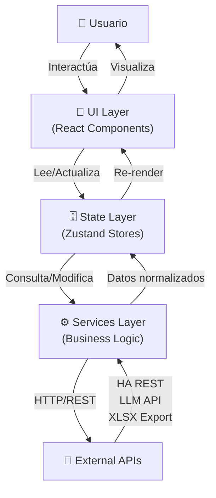

## 🏗️ Arquitectura de Componentes

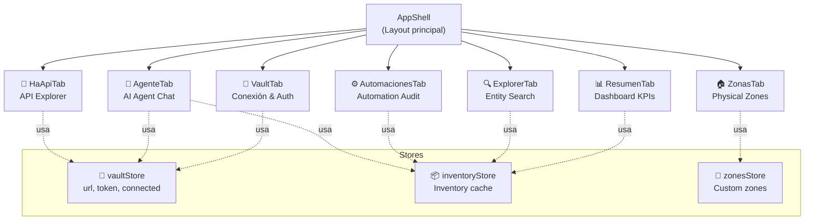

## 🔄 Flujo de Datos - Conexión a Home Assistant

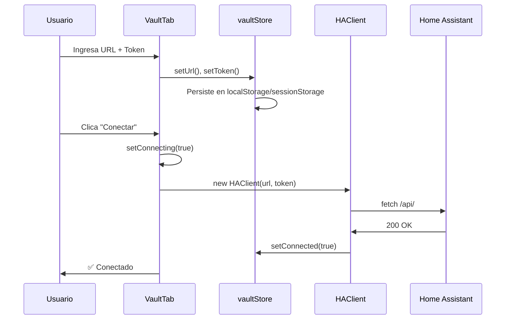

## 🔄 Flujo de Datos - Carga de Inventario

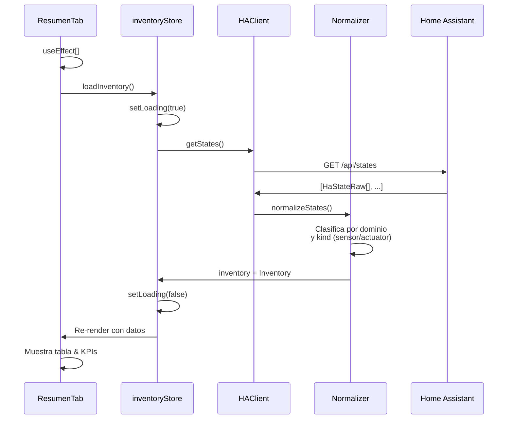

## 🤖 Flujo de Datos - Agente IA con Tool Calling

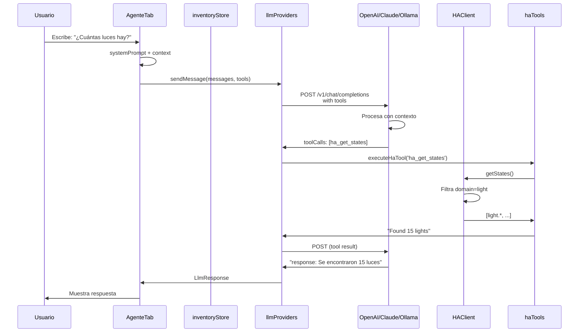

## 💾 Diagrama de Estado (Zustand Stores)

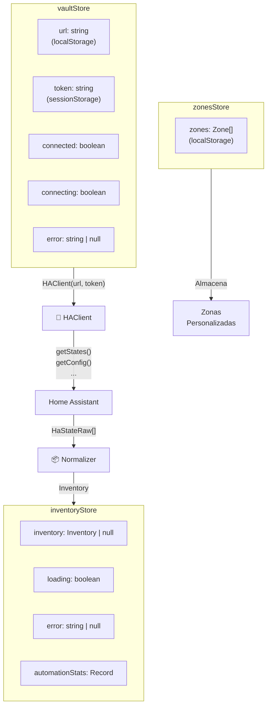

## 📡 Integraciones LLM - Arquitectura

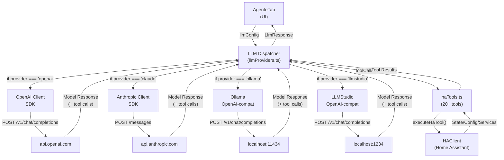

## 📊 Pipeline de Exportación

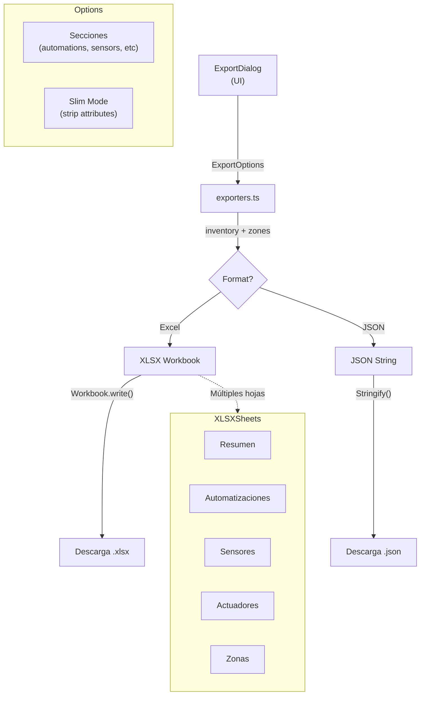

## 🔌 Proxy en Desarrollo

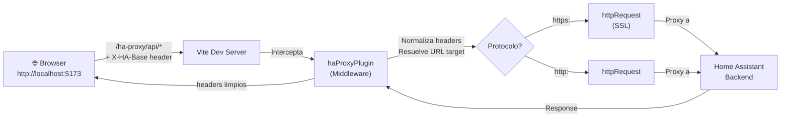

## 🛡️ Modelo de Seguridad

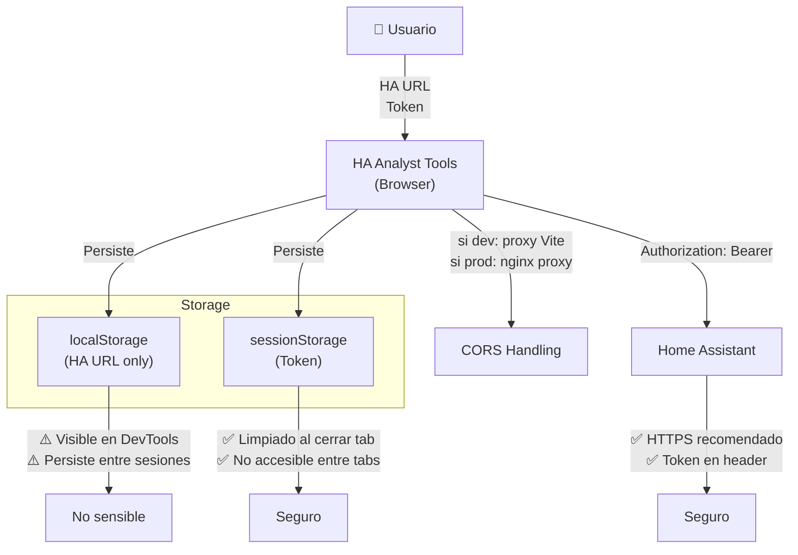

## 🗂️ Estructura de Directorios Detallada

```
src/
├── components/
│   ├── layout/
│   │   └── AppShell.tsx ← Raíz, navegación de tabs
│   │
│   ├── tabs/
│   │   ├── VaultTab.tsx ← Conexión, URL, token
│   │   ├── ResumenTab.tsx ← Dashboard con KPIs + tabla
│   │   ├── ExplorerTab.tsx ← Búsqueda entidades
│   │   ├── AutomacionesTab.tsx ← Listado automatizaciones
│   │   ├── ZonasTab.tsx ← Gestión zonas custom
│   │   ├── AgenteTab.tsx ← Chat + tools IA
│   │   └── HaApiTab.tsx ← Explorer API manual
│   │
│   └── ui/
│       ├── badge.tsx ← Etiquetas
│       ├── button.tsx ← Botones
│       ├── card.tsx ← Contenedores
│       ├── input.tsx ← Text inputs
│       ├── select.tsx ← Dropdowns
│       ├── textarea.tsx ← Text areas
│       └── ExportDialog.tsx ← Modal exportación
│
├── lib/
│   ├── haApi.ts ← Cliente REST HA (HAClient)
│   ├── haTools.ts ← Definiciones de tools (20+ tools MCP)
│   ├── llmProviders.ts ← Dispatcher LLM + integraciones
│   ├── exporters.ts ← Excel + JSON export logic
│   └── utils.ts ← Helpers (tokenCount, etc)
│
├── store/
│   ├── vaultStore.ts ← Zustand: url, token, connected
│   ├── inventoryStore.ts ← Zustand: inventory cache
│   └── zonesStore.ts ← Zustand: custom zones
│
├── types/
│   └── ha.ts ← Todas las interfaces TypeScript
│
├── App.tsx ← Router de tabs
├── main.tsx ← Entry point React
└── index.css ← Estilos globales
```

## 🔗 Dependencias y Su Rol

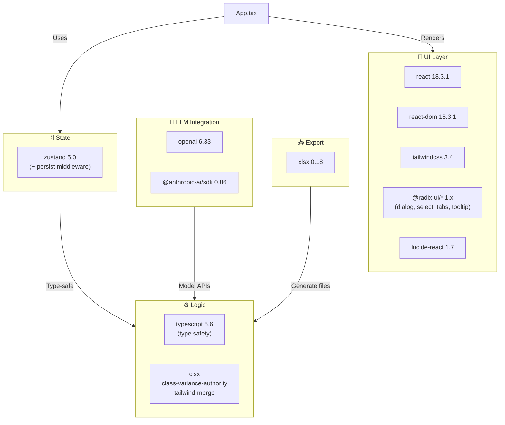

## 📈 Ciclo de Vida de Componente Tab

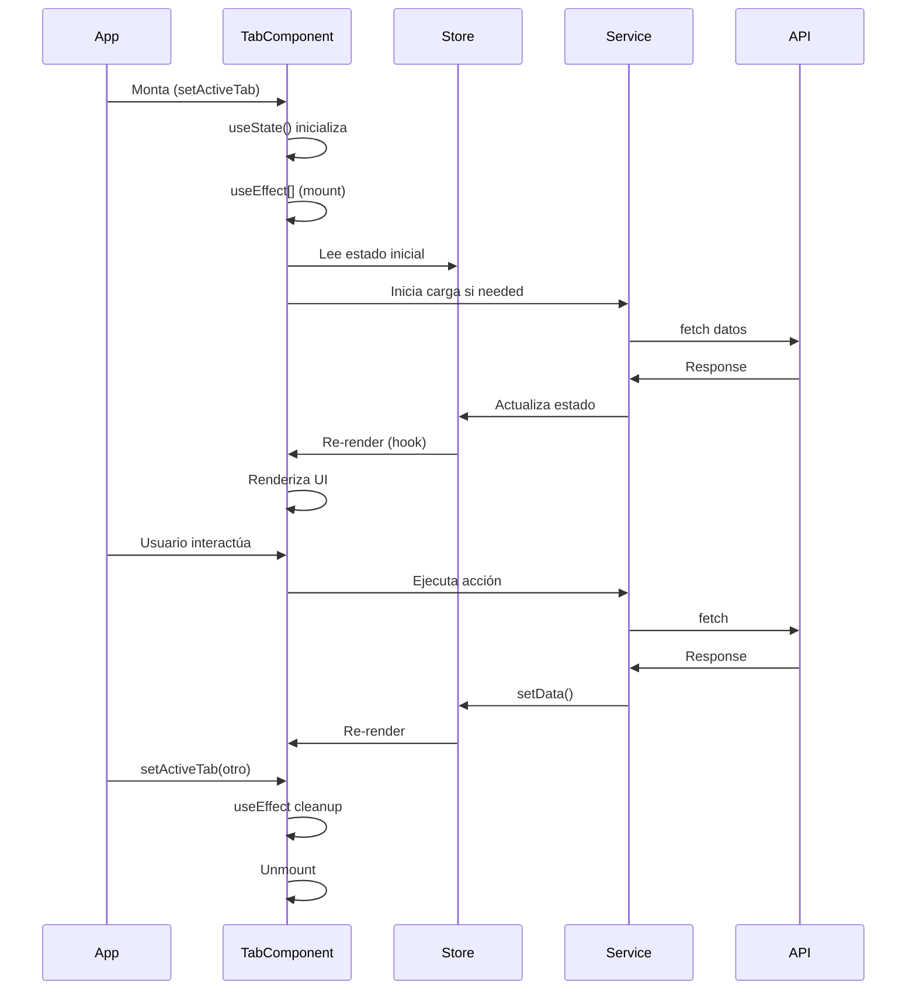

---

## 📊 Matriz de Características por Pestaña

| Feature | Vault | Resumen | Explorer | Automaciones | Zonas | Agente | HaApi |
|---------|-------|---------|----------|--------------|-------|--------|-------|
| Conexión HA | ✅ | ✅ | ✅ | ✅ | ✅ | ✅ | ✅ |
| Offline JSON | ✅ | - | - | - | - | - | - |
| Dashboard KPIs | - | ✅ | - | - | - | - | - |
| Tabla Filtrable | - | ✅ | ✅ | - | - | - | - |
| Buscar Entidades | - | ✅ | ✅ | - | - | - | - |
| Tool Calling | - | - | - | - | - | ✅ | - |
| Context Mgmt | - | - | - | - | - | ✅ | - |
| Exportar | - | ✅ | ✅ | ✅ | ✅ | - | - |
| Custom Zones | - | - | - | - | ✅ | ✅ | - |
| API Explorer | - | - | - | - | - | - | ✅ |

---

**Nota:** Todos los diagramas son conceptuales. Los números de versión y URLs son actuales al 2026-06-05.
